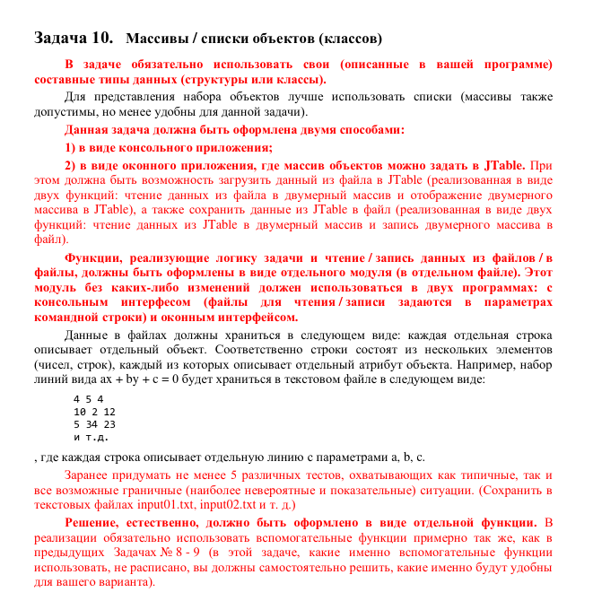

Демонстрация работы приложения: https://drive.google.com/file/d/1JqVepSY0bRwyFFDJMOnWkU_3OWktGhxU/view?usp=sharing

В программе не было использовано никакого кода Соломатина.

----

----

32. (*) Задан набор студентов в виде (ФИО, пол, номер курса, средний балл). 
Необходимо выбрать студентов для отчисления следующим образом: всех, у
кого средний балл ниже X. Однако после отчисления на каждом курсе должно остаться
не менее N студентов. Если по критерию отчисления «средний балл < X» для какого-то
курса будет отчислено слишком много студентов, то отчислить самых слабых, оставив
на данном курсе ровно N студентов. Если при этом окажется так, что несколько
студентов с одинаковыми баллами окажется на границе отчисления, то не отчислять
никого (например, надо до N отчислить 3 человек, а у нас 5 совершенно одинаковых
двоечников, то все эти 5 двоечников продолжат учиться, а на курсе, соответственно,
останется N+2 студента).