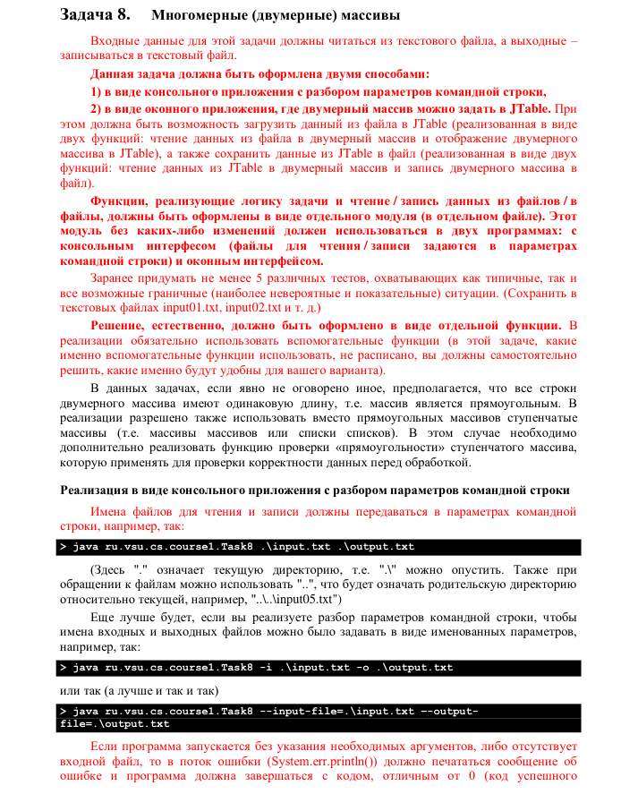

Демонстрация работы приложения: https://drive.google.com/file/d/1puRNoHfuWb5cdq20sl1bD0yj1Ra9hRyP/view?usp=sharing

В программе не было использовано никакого кода Соломатина.

---

---

22. (*) Вам передан прямоугольный массив целых чисел, описывающий поле для игры «5 в
     ряд»  (http://riddle-middle.ru/igry/krestiki-noliki).  Если  в  клетке  поля  0,  то  в
     соответствующей ячейке массива будет 0, если 1 –  1, в противном случае считаем, что
     клетка поля пустая.
     Вам  необходимо  определить,  кто  при  текущем  расположении  0  и  1  на  поле выиграл.
     Функция должна вернуть 1, если выиграли 1-цы (есть 5 в ряд единиц, но нет 5 в ряд
     нулей), -1 – если 1-цы проиграли (есть 5 в ряд нулей, но нет 5 в ряд единиц), 0 – если нет
     победителя (если нет 5 в ряд и нулей и единиц или же есть и те и другие).