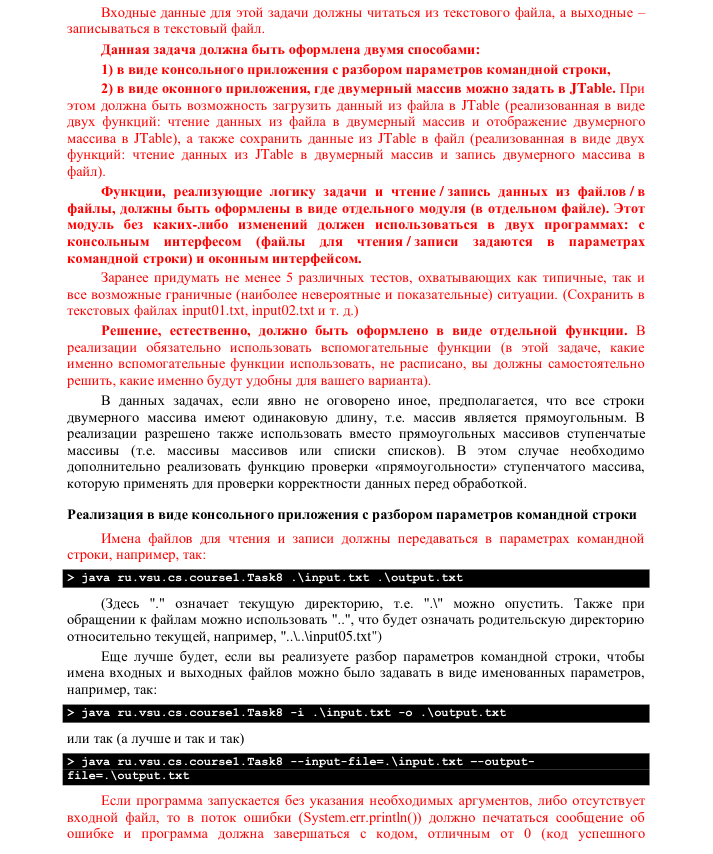
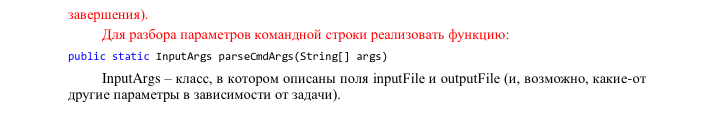

Видео работы приложения: https://drive.google.com/file/d/1IcVia2ZM4jDGXKn9GFWsbD88fjddMNOU/view?usp=sharing

В программе не было использовано никакого кода Соломатина.

---

---

25. (*) Составить максимально длинный новый список из чисел переданного списка, такой,
что числа в новом списке будут идти по порядку (т.е. отличаться на 1). Если можно
составить несколько чисел одинаковой длины, выбрать список меньших чисел,
например:
{ 9, 7, -1, 5, 4, 12, 7, 8, 1, 10, 3 } → { 3, 4, 5 }
Реализовать в виде функции
public static List<Integer> createNewList(List<Integer> list)
Для удобства реализовать дополнительные функции:
public static void sort(List<Integer> list)
Переданный список не должен измениться (т.е. для сортировки надо создать новый
список).
